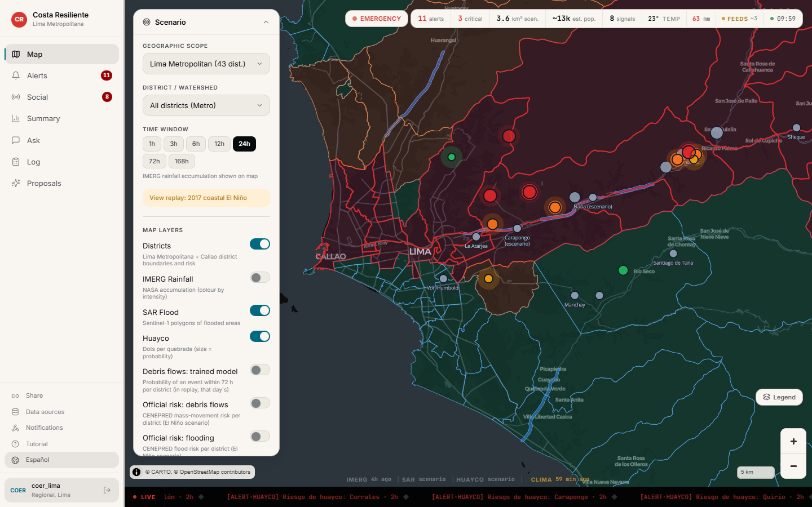
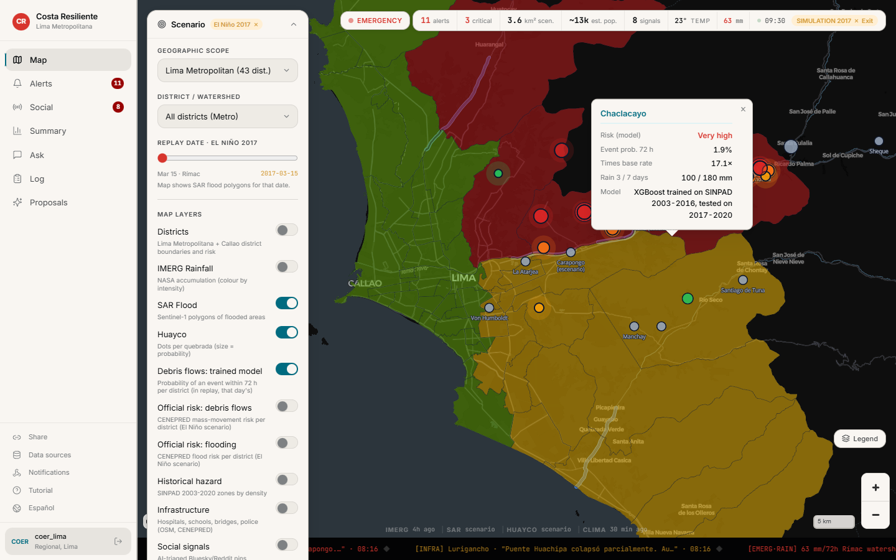
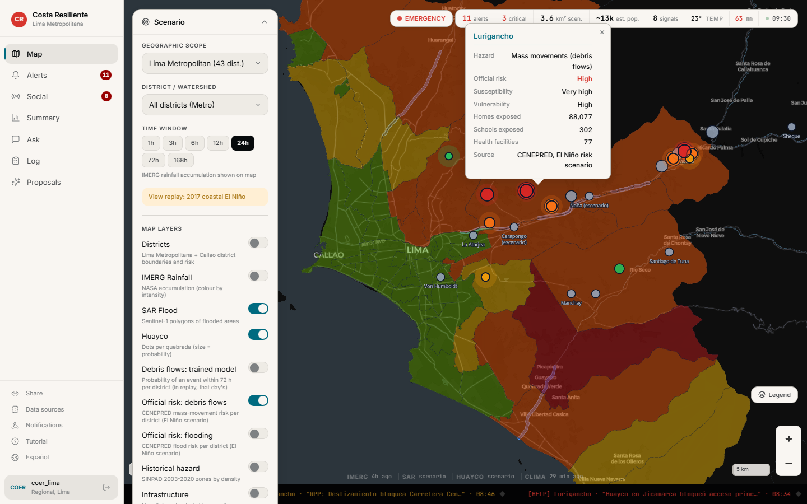
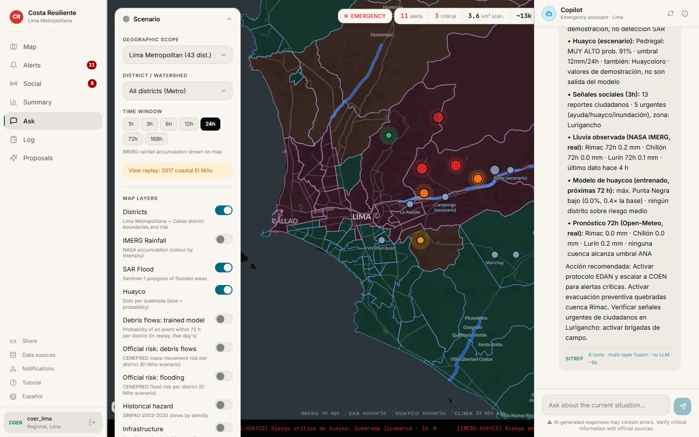
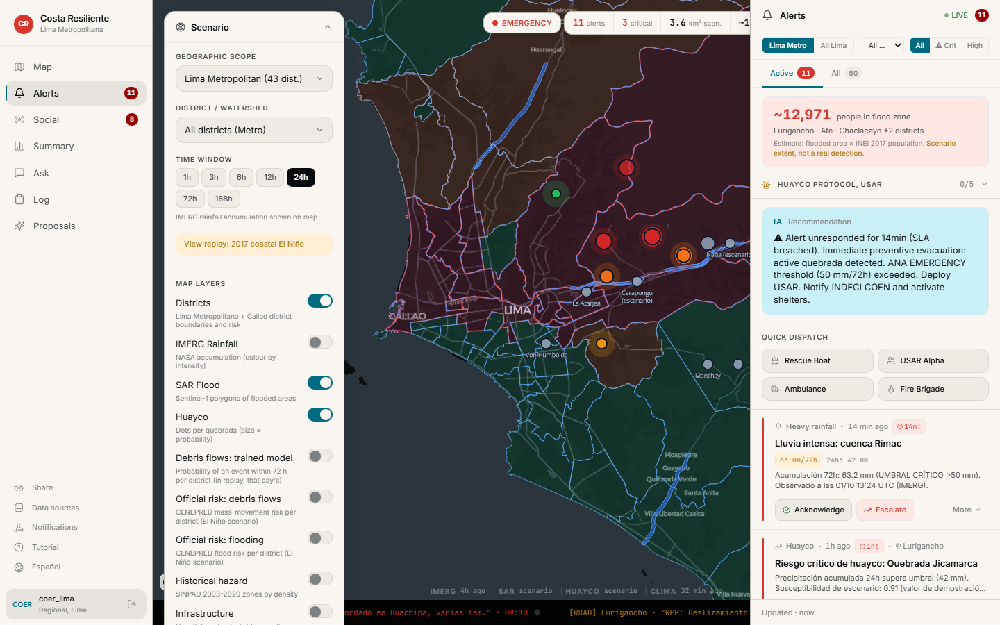
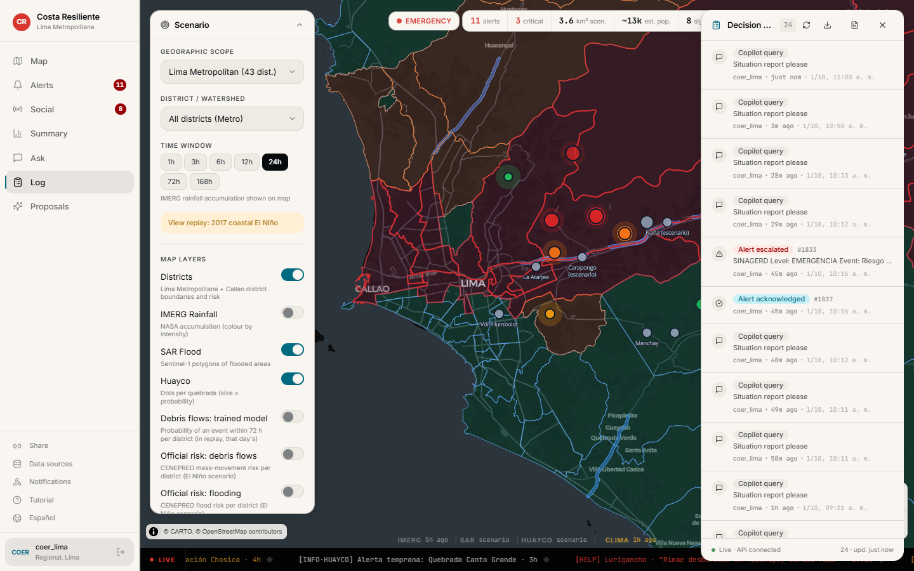
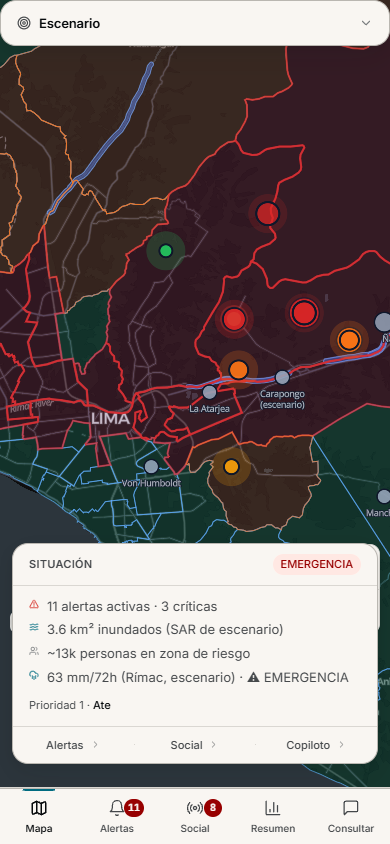
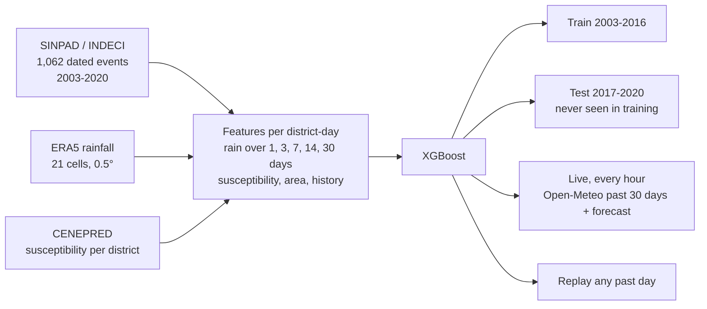
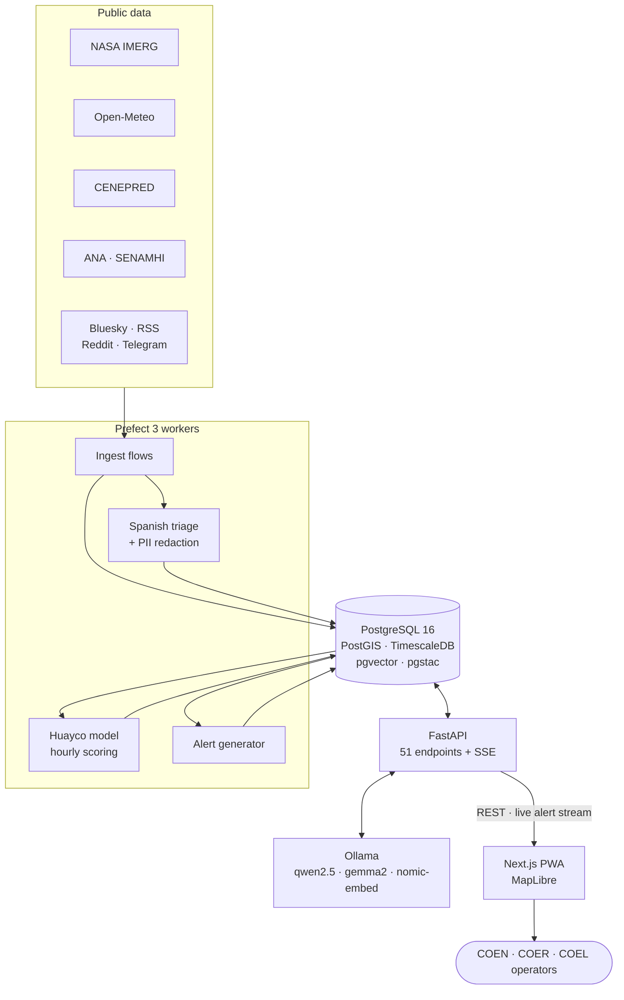

<div align="center">

# Costa Resiliente

**An operations console for floods and huaycos in Lima, Peru.**
Live rainfall, official risk data, a trained debris-flow model and a local AI copilot, in one screen, for the people on duty when the rain comes.

[](https://www.ieee.org/)
[](LICENSE)
[](#tests)
[](#cost)
[](#the-copilot)

[](apps/api)
[](apps/api)
[](apps/web)
[](apps/web)
[](infra/postgres)
[](docs/models/mass-movement.md)
[](#the-copilot)
[](docker-compose.yml)

[Features](#what-it-does) · [The model](#the-trained-huayco-model) · [Data](#data-sources) · [Architecture](#architecture) · [Run it](#run-it) · [Limitations](#what-it-does-not-do-yet)

</div>

<br/>



<!-- Demo video: add the YouTube link here once it is public. -->

## Why this exists

In 2017 a coastal El Niño hit Peru and affected more than a million people. In Lima, rain on
the dry ravines above the city turned into **huaycos**: fast flows of mud and rock that cut
off roads, bridges and whole neighbourhoods along the Rímac river. The information the
emergency centers needed was spread across a dozen agencies, websites and chat groups.

Costa Resiliente puts it in one place for the three levels of Peru's emergency system
(SINAGERD): the national center (COEN), the regional center for Lima (COER) and the district
centers (COEL). It is Spanish-first, with an English toggle, and it runs on a single machine
with no paid services and no cloud AI.

## What it does

| | |
|---|---|
| 🛰️ **Live rainfall from NASA** | IMERG Early Run, ingested every hour, basin by basin, about 4 to 5 hours behind real time |
| 🌦️ **Current weather and a 72 h forecast** | Open-Meteo, every 15 minutes, with heat, cold, wind, fog and storm warnings tuned to Lima's desert climate |
| 🧠 **A trained debris-flow model** | XGBoost, trained on 1,062 real events, tested on years it never saw, including El Niño 2017 |
| 🏛️ **The government's own risk map** | CENEPRED's El Niño risk classification and the official INEI district boundaries, from their public service |
| 🗺️ **One map for everything** | 10+ layers: districts, flood extents, huayco points, river gauges, shelters, 43,216 infrastructure points, social reports |
| ⏪ **Replay of the 2017 El Niño** | Step through March 2017 and see what the model would have said, day by day |
| 💬 **A copilot that cites its data** | Spanish situation report from six sources in under a second, on local models |
| 🚨 **Alerts with a response clock** | Acknowledge, escalate, dispatch, with SLA timers per severity |
| 🙋 **A human approves every AI alert** | The AI can only propose; nothing it writes reaches the team until an operator approves it |
| 📜 **A record nobody can rewrite** | Append-only decision log enforced by a database trigger, exported as EDAN reports (CSV and PDF) |
| 🏷️ **Honest about demo data** | Every scenario value is labelled as scenario, in the map, the popups, the copilot and the API |
| 📱 **Works on a phone** | Installable PWA with a mobile layout and offline cache of the last state |

## A tour

<table>
<tr>
<td width="50%"></td>
<td width="50%"></td>
</tr>
<tr>
<td><b>The trained model, replaying 15 March 2017.</b> Chaclacayo and Lurigancho come out very high risk, 17 and 31 times the normal rate. Civil defense recorded seven mass movements there in the next three days.</td>
<td><b>CENEPRED's official risk, per district.</b> Susceptibility, vulnerability, and how many homes, schools and health centers are exposed.</td>
</tr>
<tr>
<td></td>
<td></td>
</tr>
<tr>
<td><b>Start-of-shift report.</b> Alerts, rain, rivers, floods, huaycos and citizen reports in one answer. Each line says whether it is scenario or real data, and it ends with a recommended action.</td>
<td><b>Alerts.</b> Estimated people in flood zones, the matching INDECI protocol checklist, quick dispatch, and a response clock on every alert.</td>
</tr>
<tr>
<td></td>
<td align="center"></td>
</tr>
<tr>
<td><b>Decision log.</b> Who did what and when. Updates and deletes are rejected by the database.</td>
<td><b>On a phone.</b> Same console, mobile layout, Spanish interface.</td>
</tr>
</table>

## The trained huayco model

The model answers one question for every district, every day of the rainy season: **how
likely is a huayco, landslide or rockfall in the next 72 hours?**



**How well it does on the held-out years** (2017 to 2020, 107,690 district-days, 1,814 with an event):

| | Trained model | Same model, no rainfall | Random |
|---|:---:|:---:|:---:|
| ROC-AUC | **0.76** | 0.71 | 0.50 |
| PR-AUC | **0.060** (3.6× random) | 0.034 (2.0×) | 0.017 |
| Real events in its top 10% of warnings | **37%** | 19% | 10% |

The comparison with the rain-free baseline is the point: the rainfall features add real skill
over district history alone. Hyperparameters and the 72 h target were chosen on a validation
split inside the training years before the test years were scored.

Risk levels are multiples of the base rate (medium 2×, high 5×, very high 10×), because a
mass movement on any given district-day is rare. It is a tool for deciding where to look first,
not a trigger for evacuation. Full model card: [`docs/models/mass-movement.md`](docs/models/mass-movement.md).

## The copilot

A start-of-shift situation report runs six database tools at once and needs no language model
at all, so it answers in under a second. Free-form questions go through an agent with nine
read-only database tools and a pgvector search over Peruvian emergency protocols.

| Role | Model | Size |
|---|---|---|
| Copilot and Spanish triage of social posts | `qwen2.5:7b-instruct-q4_K_M` | 4.7 GB |
| Input and output guardrails | `gemma2:2b` | 1.6 GB |
| Protocol search embeddings | `nomic-embed-text` | 274 MB |

Everything runs on Ollama on the same machine. No question, answer or citizen report is sent
to a cloud provider, and there is no cost per question.

## Data sources

| Source | What it gives | Update | Status |
|---|---|---|---|
| NASA IMERG Early Run (GES DISC) | Observed rain per basin | Hourly, ~4-5 h latency | 🟢 Live |
| Open-Meteo | Current weather, 72 h rain forecast | 15 min / hourly | 🟢 Live |
| CENEPRED, El Niño risk scenario | Official risk, vulnerability and exposure per district; INEI boundaries | Static study | 🟢 Loaded |
| CENEPRED / COEN El Niño 2023 | INDECI warehouses, police stations | Static | 🟢 Loaded |
| INDECI SINPAD 2003-2020 | 2,063 Lima emergencies with dates, used as model labels | Historical | 🟢 Loaded |
| ERA5 (Open-Meteo archive) | 18 rainy seasons of daily rain, for training and replay | Historical | 🟢 Loaded |
| HydroBASINS | Real Rímac, Chillón and Lurín catchments, within 10% of ANA's areas | Static | 🟢 Loaded |
| OpenStreetMap | 43,216 hospitals, schools, bridges, substations, fire stations | Static | 🟢 Loaded |
| ANA and SENAMHI | River gauges | 30 min scraper | 🟡 Fragile |
| Bluesky, RSS (6 Peruvian outlets) | Public reports, triaged in Spanish by the local model | 15 min | 🟢 Live |
| Reddit, Telegram (SENAMHI channel) | Public reports | 15 min | 🟡 Best effort |
| Sentinel-1 SAR | Flood extents | Daily | 🔴 Pipeline built, no public checkpoint (see below) |

Per-source endpoints, schemas and history: [`docs/data-sources.md`](docs/data-sources.md).

## Architecture



| Layer | Technology |
|---|---|
| Frontend | Next.js 14 (App Router), TypeScript, Tailwind, MapLibre GL, Zustand, TanStack Query, PWA |
| API | FastAPI, SQLAlchemy async, JWT roles (COEN, COER, COEL), Server-Sent Events, gzip |
| Data | PostgreSQL 16 with PostGIS, TimescaleDB, pgvector and pgstac in one database; Redis; MinIO |
| Pipelines | Prefect 3: ingest, triage, model scoring, alert generation, retention |
| Machine learning | XGBoost (mass movements), local LLMs on Ollama, Presidio for PII |
| Infrastructure | Docker Compose, 10 services; Caddy for HTTPS in production |

## Responsible data handling

These are enforced in code, not just promised:

- **PII is removed before storage.** Social posts pass through Presidio before they are saved.
- **Raw social data expires** after 7 days (daily retention flow).
- **The decision log is append-only.** A database trigger rejects every update and delete.
- **A person approves every AI-generated alert** before it reaches the team.
- **Demo data can't pass as real.** Values without a real-model stamp are labelled as scenario, and the check fails closed.
- **No data leaves the machine** for AI processing.
- Aligned with Peru's personal data law (Ley 29733), OCHA data responsibility guidance and the IASC operational guidance. See [`docs/responsible-data-handling.md`](docs/responsible-data-handling.md).

## Run it

**You need** Docker with Compose v2, about 16 GB of RAM (8 GB minimum) and 25 GB of disk.
No cloud account and no API key. The demo scenario seeds itself on first start.

```bash
git clone https://github.com/Ferinjoque/costa-resiliente.git
cd costa-resiliente
cp .env.example .env
docker compose up -d                      # first build takes 5-10 minutes
```

Download the three local models once (about 6.6 GB):

```bash
docker exec costa-ollama ollama pull qwen2.5:7b-instruct-q4_K_M
docker exec costa-ollama ollama pull gemma2:2b
docker exec costa-ollama ollama pull nomic-embed-text
```

Then open **http://localhost:3000**. API docs are at http://localhost:8000/docs.

| User | Role | Password |
|---|---|---|
| `coen_lima` | National emergency center | `demo1234` |
| `coer_lima` | Lima regional center | `demo1234` |
| `coel_sjl` | San Juan de Lurigancho district center | `demo1234` |

**Reset the demo** (fresh alerts, latest NASA rain, today's model run), on Windows:

```powershell
powershell -ExecutionPolicy Bypass -File scripts/reset-demo.ps1
```

<details>
<summary><b>Live NASA rainfall and the trained model, step by step</b></summary>

1. Create a free NASA Earthdata account, generate a user token, and put it in `.env` as
   `EARTHDATA_TOKEN=...`. Without it the rest of the platform works; only IMERG stays empty.
2. Load the official districts and the real basins:
   ```bash
   docker exec costa-prefect-worker python scripts/load_cenepred_districts.py
   docker exec costa-prefect-worker python scripts/load_watersheds_hydrobasins.py --shp <hybas_sa_lev10_v1c.shp>
   ```
3. Train the model and precompute the 2017 replay:
   ```bash
   docker exec costa-prefect-worker python -m costa_workers.ml.mass_movement fetch    # ERA5, ~2 min
   docker exec costa-prefect-worker python -m costa_workers.ml.mass_movement train    # ~30 s
   docker exec costa-prefect-worker python -m costa_workers.ml.mass_movement replay 2017-01-01 2017-04-30
   ```
After that, the scheduled flows keep IMERG and the model's live run up to date every hour.

</details>

<details>
<summary><b>Deploying to a server</b></summary>

`docker-compose.prod.yml`, a Caddy reverse proxy with automatic HTTPS and `scripts/deploy.sh`
are included for a single Ubuntu VPS.

```bash
bash scripts/deploy.sh
```

</details>

### Cost

No paid API anywhere in the stack. Every data source is public and free, and the AI runs on
the same machine. The whole platform fits on one small server, about €11-17 a month on a
Hetzner CX32 or CX42, or on hardware an agency already owns.

## Tests

| Suite | Tests | Command |
|---|---:|---|
| API | 800 | `docker exec costa-api python -m pytest --asyncio-mode=auto -q` |
| Workers and model | 203 (+8 skipped) | `docker exec costa-prefect-worker python -m pytest -q` |
| Web unit | 21 | `cd apps/web && npm test` |
| Browser end-to-end, desktop and mobile | 25 | `cd apps/web && npx playwright test` |
| **Total** | **1,049** | plus `npx tsc --noEmit` with zero errors |

The browser suite drives the real running stack, not mocks.

## What it does not do yet

Being clear about this is part of the design. The same list is in the app, under
*Data sources → Known limitations*.

- **The flood extents and the huayco points per ravine are a demonstration scenario.** There is
  no publicly available trained SAR flood model for this region; the inference pipeline is
  built and waiting for one. Both layers are labelled as scenario everywhere.
- **The trained model works at district level**, with rain on 0.5° cells. It points to
  districts, not to a specific ravine.
- **IMERG trails real time by about 4 to 5 hours.** The weather and the forecast are the
  fastest feeds.
- **SINPAD records reported emergencies.** Under-reporting in remote districts is learned as
  lower risk.
- **No emergency responder has tested it in a real event yet.** It is built around their
  procedures (SINAGERD levels, INDECI protocols, EDAN reports), but not validated by them.

## Project structure

```
costa-resiliente/
├── apps/
│   ├── api/          FastAPI service, copilot agent, guardrails, tests
│   ├── web/          Next.js console, map, panels, Playwright suite
│   └── workers/      Prefect flows: ingest, triage, huayco model, alerts
├── infra/postgres/   Schema and migrations
├── scripts/          Data loaders, deploy, demo reset
└── docs/             Status, data sources, model card, architecture, runbook
```

## Documentation

| Document | What's in it |
|---|---|
| [`docs/STATUS.md`](docs/STATUS.md) | What is built, what is pending, test results |
| [`docs/models/mass-movement.md`](docs/models/mass-movement.md) | The trained model: data, validation, limitations, how to reproduce |
| [`docs/data-sources.md`](docs/data-sources.md) | Every source, its endpoint, its status and its history |
| [`docs/architecture.md`](docs/architecture.md) | System design and data flow |
| [`docs/responsible-data-handling.md`](docs/responsible-data-handling.md) | Privacy, retention, legal alignment |
| [`docs/operator-runbook.md`](docs/operator-runbook.md) | How an operator uses the console |
| [`docs/decisions/`](docs/decisions/) | Architecture decision records |

## License and credits

Apache 2.0, see [`LICENSE`](LICENSE) and [`NOTICE`](NOTICE).

Built by **Fernando Injoque** for the IEEE Response Quest Challenge 2026.

Data from NASA GES DISC (IMERG), Open-Meteo (CC BY 4.0), ECMWF ERA5, CENEPRED, INDECI SINPAD,
ANA, SENAMHI, HydroSHEDS / HydroBASINS (Lehner & Grill, 2013) and OpenStreetMap contributors
(ODbL). Thanks to each of these agencies and projects for keeping their data open.
