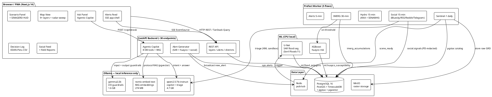
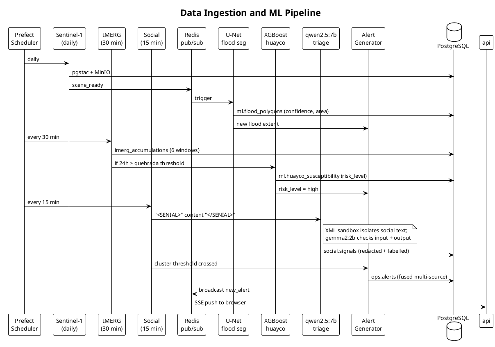
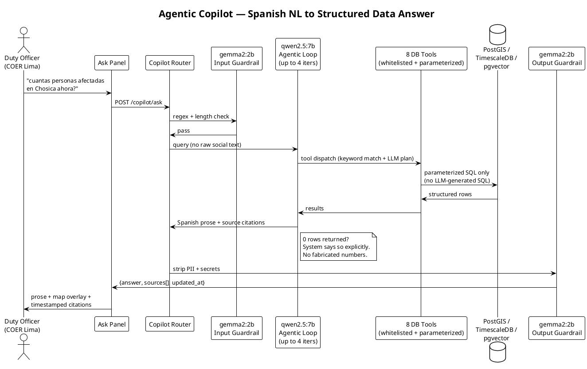
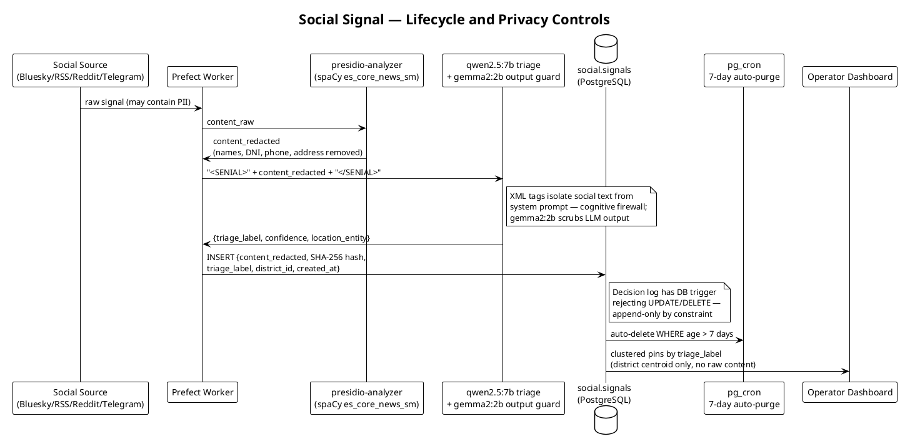
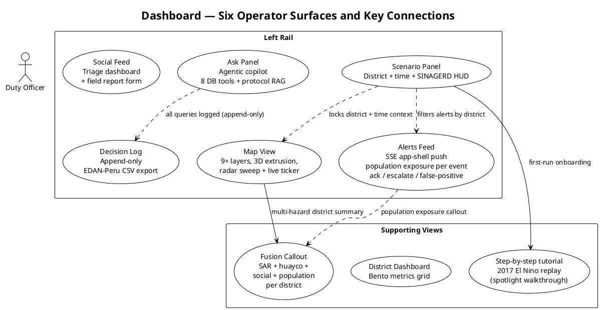

# Costa Resiliente — IEEE Response Quest 2026 Phase 2 Submission

Paste each section into the corresponding form field. Character targets are noted.
PlantUML blocks at the bottom should be rendered at plantuml.com and uploaded as PNG.

---

## Submission Title

Costa Resiliente: Near-Real-Time Flood and Huayco Situational Awareness for Lima Metropolitana

---

## Is this a Team Submission?

No

---

## Disaster Scenario

Lima Metropolitana faces recurring El Niño Costero floods and huaycos that consistently overwhelm emergency response coordination. The 2017 El Niño Costero — the reference scenario for this project — left over 1.6 million people affected nationally and caused catastrophic losses across Lima's ten priority quebradas, including Huaycoloro, Pedregal, Quirio, and Carapongo.

Peru's SINAGERD structure has three operational tiers: COEN at the national level, COER Lima regionally, and 43 district-level COELs. None of them currently have a unified situational awareness tool. Duty officers piece together information from emailed satellite images, ANA PDF bulletins, and WhatsApp groups — no one is fusing those streams in real time.

This platform targets the COER Lima duty officer who needs to decide within minutes whether to activate district emergency protocols, issue evacuation orders for specific quebradas, or escalate to COEN. The goal is to bring together Sentinel-1 SAR flood extents, NASA IMERG rainfall, ANA and SENAMHI station readings, Spanish-language social signals, 18 years of SINPAD historical data, and ML-derived risk predictions into one operational dashboard built for the 2026-2027 El Niño cycle.

---

## Concept Overview

Costa Resiliente is an open-source near-real-time platform designed to give Lima's emergency managers a single operational picture during El Niño floods and huaycos. It will fuse satellite radar, hydrometeorological, social, infrastructure, and historical data through an agentic AI copilot that reasons across all sources and responds in Spanish. The full system is designed to run on a nine-service Docker Compose stack deployable on a single VPS for under $25 per month, keeping infrastructure costs within reach of public emergency management agencies.

### Architecture

The backend will be a FastAPI (Python 3.12) service with around 30 REST endpoints and an SSE stream for live alert delivery. PostgreSQL 16 will combine PostGIS 3.4, TimescaleDB, pgstac, and pgvector in a single instance — spatial queries, time-series aggregations, satellite catalog lookups, and vector similarity search all happen without cross-service round trips, which matters for query latency during a live event. Prefect 3 will orchestrate all ingestion flows with retries, and Redis will decouple ingest events from ML inference triggers. A dedicated Ollama container will serve three local models: qwen2.5:7b-instruct-q4_K_M for copilot queries and signal triage (4.7 GB), gemma2:2b as a fast guardrail classifier (1.6 GB), and nomic-embed-text for pgvector RAG embeddings (274 MB). The frontend will be a Next.js 14 PWA targeting WCAG AA compliance and offline capability.

### Data Sources

Ten data sources are planned. Sentinel-1 GRD scenes from Planetary Computer at 10m resolution with about three hours of post-acquisition latency. NASA IMERG Early Run V07B in six accumulation windows per Lima watershed, polled every 30 minutes. ANA and SENAMHI stations scraped every 15 minutes. INDECI SINPAD 2003-2020 (2,063 Lima records) for data-driven hazard zone classification across 50 district polygons. INEI 2017 census at district level for population exposure. Over 43,000 OSM infrastructure points including hospitals, schools, bridges, and substations. Social signals from Bluesky Jetstream v2, six Peruvian news RSS feeds, Reddit (r/Peru, r/Lima, r/Chosica), and the SENAMHI Telegram channel.

### ML Components

Three ML pipelines will run entirely on local hardware with no cloud API dependency. SAR flood segmentation will use a U-Net from Sen1Floods11 weights (Bonafilia et al. 2020 CVPR), processing Sentinel-1 IW VV/VH inputs to produce flood polygons with confidence scores, targeting under five minutes of CPU inference per scene. Huayco susceptibility will follow the XGBoost methodology of Castro-Cabrera et al. (Geosciences 14(6):168, 2024), combining slope, aspect, NDVI, and IMERG accumulations per quebrada to auto-trigger alerts at threshold. Spanish signal triage will use qwen2.5:7b-instruct with Pydantic-validated JSON output; all social content will be sandboxed in XML tags as a cognitive firewall against prompt injection.

### Agentic AI Layer

The operator copilot will be a multi-tool agentic loop with eight whitelisted parameterized database tools: get_flood_polygons, get_huayco_risk, get_river_levels, get_social_clusters, get_infrastructure_impact, get_rainfall_accumulation, get_active_alerts, and search_protocols. That last tool will run pgvector RAG over INDECI, MINSA, and CENEPRED emergency protocols, so operators can ask procedural questions alongside data queries in the same interface. The agent will dispatch up to four tool iterations per query. Input guardrails apply regex filtering before any LLM call; output guardrails redact PII. The LLM will never touch raw SQL and will say so explicitly if a query returns no data.

### Dashboard

The Next.js 14 dashboard will offer six main operator surfaces from a persistent left rail: Scenario Panel (district and time context with a SINAGERD HUD), Map View (layer toggles including 3D SAR flood extrusion and a radar sweep), Alerts Feed (SSE-pushed at app shell level so map district colors update on new events regardless of open panel), Ask Panel (agentic copilot), Decision Log (append-only with EDAN-Peru CSV export for COEN reporting), and a Social Feed panel. Supporting panels will include multi-hazard district fusion and read-only share tokens for inter-agency collaboration. Onboarding will be a step-by-step spotlight walkthrough keyed to a synthetic 2017 El Niño Costero replay, where each step activates the corresponding map layer automatically so new operators walk through the historical event before facing a live one.

---

## Timeliness, Real-Time Responsiveness & Technical Reliability

The design targets near-real-time updates across all data tiers. Sentinel-1 flood polygons should be available roughly three hours after satellite acquisition plus under five minutes of local U-Net inference. NASA IMERG delivers rainfall accumulations every 30 minutes with about four hours of global lag. ANA and SENAMHI stations will be polled every 15 minutes. Social signals from Bluesky, RSS, Reddit, and Telegram will be ingested every 15 minutes with triage completing in the same flow.

New alerts will be pushed to the browser via Server-Sent Events hoisted to the Next.js app shell, so map district colors update on new events without any panel being open. Prefect 3 will handle retries and exponential backoff for all ingestion flows, with Redis decoupling ingest from ML inference. A DataFreshnessBar will show the last updated timestamp per layer at all times, which matters for operators making time-sensitive calls. One known fragility: ANA has no public REST API, so the scraper will parse HTML; a zero-row alert trigger is planned for early detection of failures, with manual CSV import as fallback.

---

## Comprehensiveness, Use of Available Data & Novel Data Discovery

Ten data sources are planned across satellite, hydrometeorological, historical, social, and infrastructure domains. Sentinel-1 GRD (10m, free Copernicus via Planetary Computer) will drive SAR flood mapping. NASA IMERG Early Run V07B will track rainfall across six accumulation windows per watershed. ANA and SENAMHI will feed the station layer. INDECI SINPAD 2003-2020 provides 2,063 Lima emergency records for data-driven hazard zone classification across 50 district polygons — chosen because CENEPRED SIGRID requires SSO authentication that blocks programmatic access. INEI 2017 census will enable per-event population exposure. OSM infrastructure covers over 43,000 critical points. Social intelligence spans Bluesky, six Peruvian RSS feeds, three Reddit subreddits, and the SENAMHI Telegram channel.

Three choices stand out as novel: Bluesky AT Protocol is nearly absent from disaster platforms yet delivers real-time Spanish citizen reports at no cost. SINPAD event density as a hazard proxy is reproducible and independently verifiable in a way that portal imports are not. Running all ML models on local Ollama eliminates cloud API dependencies entirely. Gaps are acknowledged honestly: SIGRID is blocked, an IGP seismic feed is a stretch goal, and the ANA scraper fragility is documented.

---

## Integration, Synthesis Quality & Responsible Data Handling

All data streams will converge in a single PostgreSQL 16 instance combining PostGIS 3.4, TimescaleDB, pgstac, and pgvector, so a single query can join SAR flood extents, rainfall accumulations, station observations, and social clusters without cross-service calls. Flood polygons will be joined against INEI census for per-event population exposure. Auto-alert generation fuses all three ML outputs so no single source triggers alone. The copilot's search_protocols tool runs pgvector RAG over INDECI, MINSA, and CENEPRED protocols alongside live data.

Responsible handling will be enforced in code: presidio-analyzer will redact PII from every social signal before storage, with SHA-256 hashing for deduplication. Social text will be sandboxed in XML tags and never enter the operator query context. A gemma2:2b output guardrail strips PII from all responses. A pg_cron job purges social signals after seven days. The decision log uses a PostgreSQL trigger rejecting UPDATE/DELETE — append-only by constraint. The system targets Peru Ley 29733, OCHA Data Responsibility Guidelines (2025), and IASC Operational Guidance (April 2023).

---

## Usability, Clarity & Operational Readiness for Emergency Responders

The interface is designed for the COER Lima duty officer: Spanish-first, high-stress, time-critical. The left rail follows the operator's natural decision sequence — set context, check the map, act on alerts, query the data, review the log. Alert actions map to SINAGERD vocabulary. The decision log exports to EDAN-Peru CSV for COEN reporting. The multi-hazard fusion panel surfaces population at risk combining flood, huayco, social, and census data in one view.

Spanish is the default with an English toggle. The design targets WCAG AA contrast verified at the design token level, with full keyboard navigation on every control and aria-live=polite on the SSE alert ticker for screen reader compatibility. The platform will be a PWA — installable with a service worker for offline continuity — and responsive across mobile, tablet, and desktop. Onboarding is a step-by-step spotlight walkthrough keyed to a synthetic 2017 El Niño Costero replay, letting a new operator walk through the historical event before a live one.

---

## Scenario Fit, Insightfulness, Innovation & Technical/Data Creativity

The platform is scoped to one scenario: El Niño Costero floods and huaycos in Lima Metropolitana, covering 43 districts, three watersheds, and ten priority quebradas. A synthetic replay of the 2017 event will let judges walk through it directly. Primary users are COER Lima duty officers and COEL coordinators, with EDAN-Peru CSV output for COEN reporting.

Several technical choices are uncommon in this space. The agentic copilot combines a multi-tool reasoning loop, pgvector RAG over INDECI/MINSA/CENEPRED protocols, and a fast output guardrail — a production-grade AI safety stack applied to a humanitarian tool, informed by the project owner's research on prompt injection. Spanish NLP running entirely offline on qwen2.5:7b-instruct is unusual; most platforms skip it or depend on cloud APIs that can fail during a disaster. Bluesky as a signal source is absent from comparable disaster platforms. The central insight will be population exposure per SAR flood polygon — U-Net flood extent joined against INEI census, turning a map layer into "how many people are affected" on each alert card.

---

## Diagrams (PlantUML — render at plantuml.com and upload as PNG)

### Diagram 1 — System Architecture

### Diagram 2 — Ingestion and ML Pipeline

### Diagram 3 — Agentic Copilot Flow

### Diagram 4 — Responsible Data Handling

### Diagram 5 — Dashboard Operator Flow

